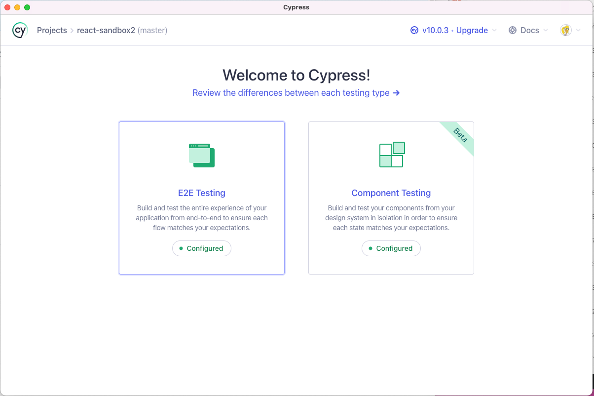
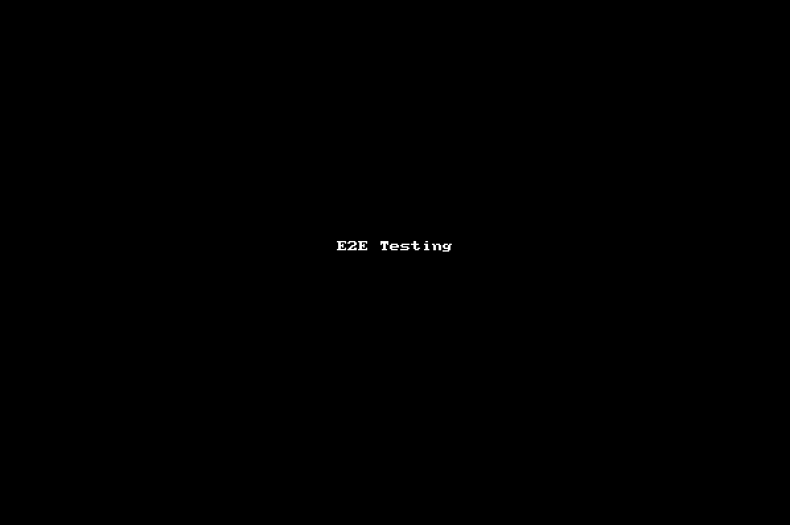
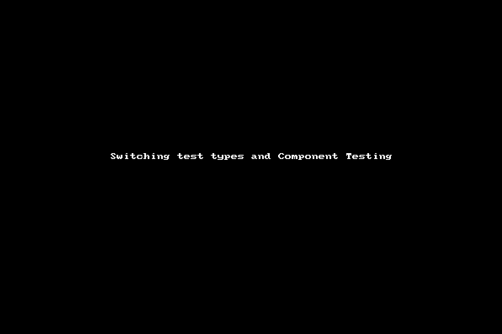

# Welcome

This project is a sandbox proof of concept for `Cypress` testing.

## Starting/Initializing

---

1. Run `npm i` to install library modules
2. `npm start` to start a local environment of the project
3. Continue with following Cypress steps below...

   ### Cypress Integration

4. Open a new terminal and run `npx cypress open` to begin the Cypress upgrade to version 10 (just follow the steps on the UI).

## Testing

---

> You have a few options on how you want to interact with testing. To begin,
open a new terminal and enter one of the following options:

### `npm test`

Opens the interactive Cypress GUI. You can switch between **E2E** testing and **Component** testing

    
Differences and more information...

Please read the following for the differences: 
https://docs.cypress.io/guides/core-concepts/testing-types#Common-scenarios-for-component-tests

Brief summary:

| E2E                                                                                                                                                                                                                                                                                                                      | Component                                                                                                                                                                                                                                                                                                                           |
|--------------------------------------------------------------------------------------------------------------------------------------------------------------------------------------------------------------------------------------------------------------------------------------------------------------------------|-------------------------------------------------------------------------------------------------------------------------------------------------------------------------------------------------------------------------------------------------------------------------------------------------------------------------------------|
| - Ensure your app is functioning as a cohesive whole  - Tests match the user experience  - Validates critical workflows like authentication and purchasing  - Ensures data is persisted and displayed through multiple screens  - Useful for running Smoke Tests and System Checks before deployment | - Doesn't rely on any external system to run  - Doesn't ensure overall app quality  - Doesn't call into external APIs/Services  - **Example usage:** Testing a date picker works properly for a variety of scenarios  - **Example usage:** Testing that a form shows and hides specific sections based on input |

### Navigating

---
After you run `npm test`, an interactive GUI will open.

#### E2E Testing

You can navigate between the two testing types like so:

#### Component Testing

### `npm run record-test`

Records and uploads a video to the Cypress dashboard of the test run 
[Cypress Test Run Dashboard](https://dashboard.cypress.io/projects/abqn2e/runs?branches=%5B%5D&committers=%5B%5D&flaky=%5B%5D&page=1&status=%5B%5D&tags=%5B%5D&timeRange=%7B%22startDate%22%3A%221970-01-01%22%2C%22endDate%22%3A%222038-01-19%22%7D)

### `npm run test-all`

Records and uploads the test run AND opens the interactive Cypress GUI

---

## Available Scripts

  
Click to see available scripts...

### `npm start`

Runs the app in the development mode. 
Open [http://localhost:3000](http://localhost:3000) to view it in the browser.

The page will reload if you make edits. 
You will also see any lint errors in the console.

### `npm test`

Launches the Cypress test runner in the interactive watch mode. 

### `npm run build`

Builds the app for production to the `build` folder. 
It correctly bundles React in production mode and optimizes the build for the best performance.

The build is minified and the filenames include the hashes. 
Your app is ready to be deployed!

See the section about [deployment](https://facebook.github.io/create-react-app/docs/deployment) for more information.

### `npm run eject`

**Note: this is a one-way operation. Once you `eject`, you can’t go back!**

If you aren’t satisfied with the build tool and configuration choices, you can `eject` at any time. This command will remove the single build dependency from your project.

Instead, it will copy all the configuration files and the transitive dependencies (Webpack, Babel, ESLint, etc) right into your project so you have full control over them. All of the commands except `eject` will still work, but they will point to the copied scripts so you can tweak them. At this point you’re on your own.

You don’t have to ever use `eject`. The curated feature set is suitable for small and middle deployments, and you shouldn’t feel obligated to use this feature. However we understand that this tool wouldn’t be useful if you couldn’t customize it when you are ready for it.

### `npm run record-test`

Records and uploads a video to the Cypress dashboard of the test run

[Cypress Test Run Dashboard](https://dashboard.cypress.io/projects/abqn2e/runs?branches=%5B%5D&committers=%5B%5D&flaky=%5B%5D&page=1&status=%5B%5D&tags=%5B%5D&timeRange=%7B%22startDate%22%3A%221970-01-01%22%2C%22endDate%22%3A%222038-01-19%22%7D)

### `npm run test-all`

Records and uploads the test run and opens the interactive Cypress GUI

Runs Cypress CLI

---

## Learn More

   
Click to learn more...

You can learn more in the [Create React App documentation](https://facebook.github.io/create-react-app/docs/getting-started).

To learn React, check out the [React documentation](https://reactjs.org/).

### Code Splitting

This section has moved here: https://facebook.github.io/create-react-app/docs/code-splitting

### Analyzing the Bundle Size

This section has moved here: https://facebook.github.io/create-react-app/docs/analyzing-the-bundle-size

### Making a Progressive Web App

This section has moved here: https://facebook.github.io/create-react-app/docs/making-a-progressive-web-app

### Advanced Configuration

This section has moved here: https://facebook.github.io/create-react-app/docs/advanced-configuration

### Deployment

This section has moved here: https://facebook.github.io/create-react-app/docs/deployment

### `npm run build` fails to minify

This section has moved here: https://facebook.github.io/create-react-app/docs/troubleshooting#npm-run-build-fails-to-minify

